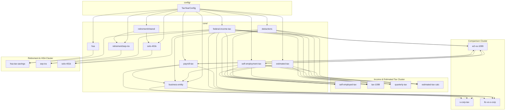

# Calculator Dependency Map — TaxChecker 1.0

This document maps calculator products to shared engine modules and identifies reuse boundaries. Use it to prioritize implementation order and avoid duplicate logic.

---

## Visual Overview



---

## Cluster 1: Income & Estimated Tax

**Calculators:** Self Employed Tax, 1099 Tax, Quarterly Tax, Estimated Tax

| Shared module | Role |
|---|---|
| `core/self-employment-tax.ts` | SE tax on net self-employment income |
| `core/deductions.ts` | 50% SE tax deduction; standard deduction |
| `core/federal-income-tax.ts` | Income tax on taxable income |
| `core/estimated-tax.ts` | Quarterly amounts, due dates, safe harbor flags |

### Differentiation (calculator layer only)

| Calculator | Unique orchestration |
|---|---|
| **Self Employed Tax** | Full annual liability: SE + income tax; optional W-2 wages for wage base |
| **1099 Tax** | Same engine as Self Employed; UX framing for 1099-NEC/MISC income; may emphasize gross → net path |
| **Quarterly Tax** | Calls estimated-tax module; emphasizes payment schedule and per-quarter amounts |
| **Estimated Tax** | Broader inputs (other income, credits, withholding); safe harbor comparison |

### Implementation note

`tax-1099.ts` should delegate to the same internal pipeline as `self-employed-tax.ts` (shared `core/pipeline/self-employment-annual.ts` or equivalent). Only `calculatorId`, default copy, and input labels differ.

**Recommended build order:** `self-employment-tax` core → `self-employed-tax` calculator → `tax-1099` (thin wrapper) → `estimated-tax` core → `quarterly-tax` + `estimated-tax` calculators.

---

## Cluster 2: W2 vs 1099 Comparison

**Calculator:** W2 vs 1099

| Reused module | Path |
|---|---|
| W-2 payroll tax (employee FICA) | `core/payroll-tax.ts` |
| Self-employment path | `core/self-employment-tax.ts` + `core/federal-income-tax.ts` |
| Standard deduction | `core/deductions.ts` |

### Unique logic

- Parallel computation of two scenarios with identical gross compensation
- W-2 scenario: employer pays employer FICA (optional visibility); employee FICA + income tax withholding estimate (simplified flat or user-provided withholding rate in 1.0)
- 1099 scenario: full SE tax + income tax
- Delta output: net take-home difference, employer cost (if B2B user enables)

**Does not reuse:** `business-entity.ts` (no S Corp in this calculator)

---

## Cluster 3: Business Entity Comparison

**Calculators:** S Corp Tax, LLC vs S Corp

| Shared module | Role |
|---|---|
| `core/business-entity.ts` | Side-by-side LLC vs S Corp tax computation |
| `core/self-employment-tax.ts` | LLC path |
| `core/payroll-tax.ts` | S Corp salary FICA (employee + employer) |
| `core/federal-income-tax.ts` | Both paths |

### Differentiation

| Calculator | Focus |
|---|---|
| **S Corp Tax** | Single-entity S Corp analysis: salary vs distribution split, total tax, payroll tax on salary |
| **LLC vs S Corp** | Comparison view: LLC (default disregarded) vs S Corp election; savings summary |

**Implementation note:** `llc-vs-s-corp.ts` and `s-corp-tax.ts` both call `business-entity.ts`. S Corp-only calculator passes `entityMode: 's_corp_detail'` for extra breakdown (employer FICA, distribution amount).

---

## Cluster 4: Retirement & HSA Tax Savings

**Calculators:** HSA Tax Savings, SEP IRA, Solo 401(k)

| Shared module | Role |
|---|---|
| `core/retirement/shared.ts` | Self-employment compensation definition |
| `core/federal-income-tax.ts` | Tax savings from reduced taxable income |
| `core/hsa.ts` | HSA-specific limits |
| `core/retirement/sep-ira.ts` | SEP limit math |
| `core/retirement/solo-401k.ts` | Deferral + profit-sharing limits |

### Shared pattern: Tax savings estimate

```
taxSavings = contributionAmount × marginalFederalRate
```

1.0 uses **marginal rate** from user's taxable income before contribution (documented assumption). Effective-rate option deferred.

### Cross-calculator links

- SEP IRA and Solo 401(k) share compensation worksheet logic — user with both plans needs coordination (excluded in 1.0; warn if user indicates existing plan).

---

## Dependency Matrix

| Calculator | FIT | SET | DED | EST | PAY | HSA | SEP | 401k | BE |
|---|:---:|:---:|:---:|:---:|:---:|:---:|:---:|:---:|:---:|
| Self Employed | ✓ | ✓ | ✓ | ○ | ○ | | | | |
| 1099 | ✓ | ✓ | ✓ | ○ | ○ | | | | |
| Quarterly | ✓ | ✓ | ✓ | ✓ | ○ | | | | |
| Estimated | ✓ | ✓ | ✓ | ✓ | ○ | | | | |
| W2 vs 1099 | ✓ | ✓ | ✓ | | ✓ | | | | |
| S Corp | ✓ | | ✓ | | ✓ | | | | ✓ |
| LLC vs S Corp | ✓ | ✓ | ✓ | | ✓ | | | | ✓ |
| HSA | ✓ | | | | | ✓ | | | |
| SEP IRA | ✓ | ✓* | | | | | ✓ | | |
| Solo 401(k) | ✓ | ✓* | | | | | | ✓ | |

✓ = required · ○ = optional · \* = compensation from net SE profit

---

## Shared Types Across Calculators

| Type | Location | Consumers |
|---|---|---|
| `FilingStatus` | `types/filing-status.ts` | All |
| `SelfEmploymentInputs` | `types/inputs.ts` | SE, 1099, Quarterly, Estimated, SEP, Solo 401k |
| `EstimatedTaxInputs` | `types/inputs.ts` | Quarterly, Estimated |
| `EntityComparisonInputs` | `types/inputs.ts` | S Corp, LLC vs S Corp |
| `RetirementContributionInputs` | `types/inputs.ts` | SEP, Solo 401k |
| `HSAInputs` | `types/inputs.ts` | HSA |
| `CalculatorResult<T>` | `types/outputs.ts` | All |

---

## Implementation Sprint Recommendation

| Phase | Deliverables |
|---|---|
| **Sprint 2** | `TaxYearConfig` interface + unverified 2025 stub; `rounding`, `federal-income-tax`, `self-employment-tax`, `deductions`; `self-employed-tax` + tests |
| **Sprint 3** | `estimated-tax`; 1099, Quarterly, Estimated calculators; verify IRS constants |
| **Sprint 4** | `payroll-tax`, `business-entity`; W2 vs 1099, S Corp, LLC vs S Corp |
| **Sprint 5** | `hsa`, `retirement/*`; HSA, SEP, Solo 401k calculators |

---

## Anti-Patterns to Avoid

1. **Copy-paste SE tax math** in `tax-1099.ts` — always delegate to core.
2. **Importing calculator A from calculator B** — extract to core.
3. **Hardcoding limits** in calculator files — use `TaxYearConfig`.
4. **Mixing UI validation** into engine — keep Zod at boundary only.

---

## Change Log

| Date | Change |
|---|---|
| 2026-06-16 | Initial dependency map for TaxChecker 1.0 |
